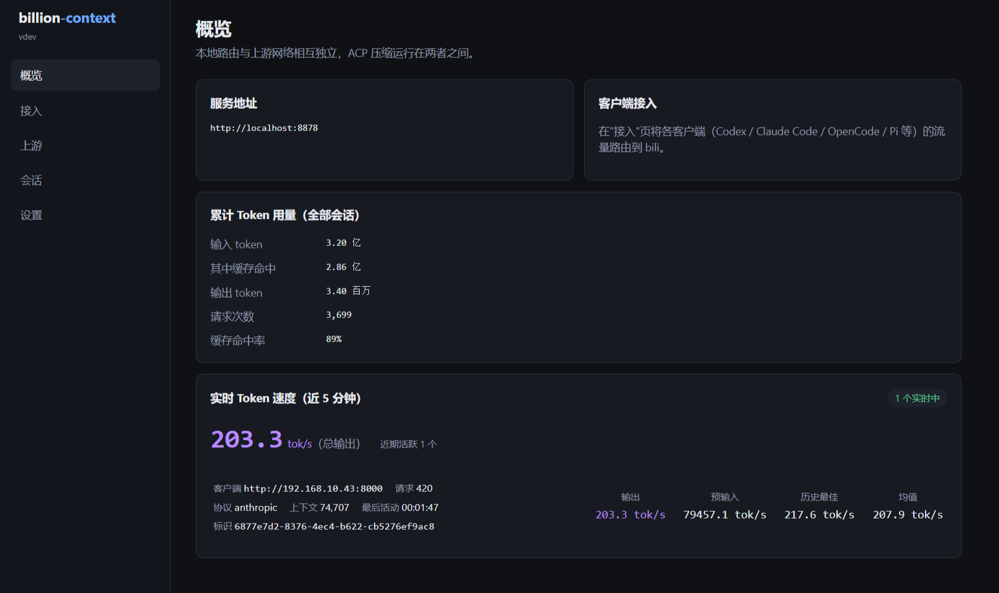
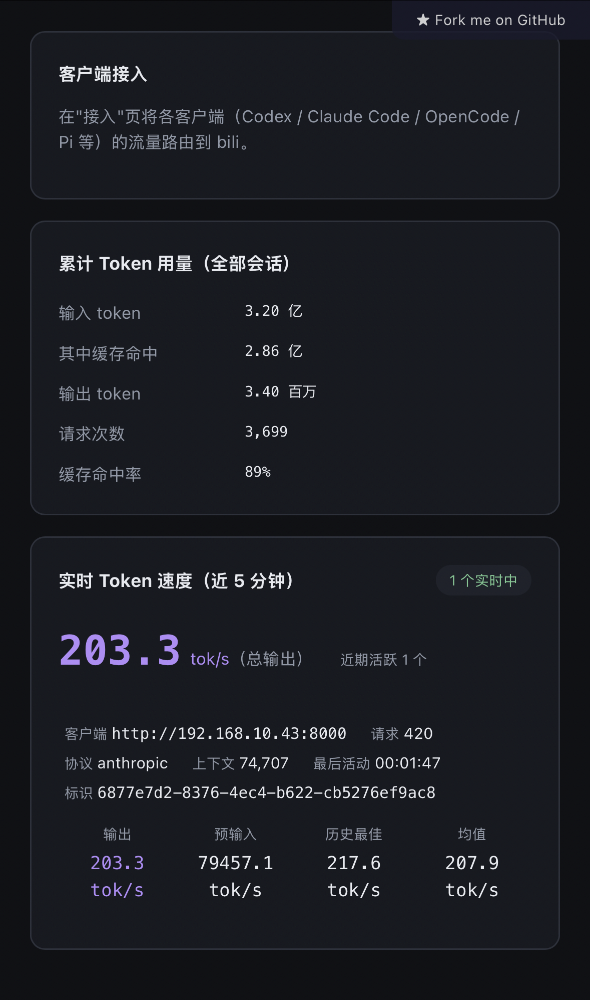

# billion-context-optimized

`billion-context` 的**优化增强版**，以单文件二进制形式分发（免 Node 运行时）。

上游项目：https://github.com/ranxianglei/billion-context （作者 ranxianglei）

本仓库**只做优化与修复，不改动上游核心**。

---

## 提供什么功能

- **子代理并发**：多个子代理（subagent）与主会话并行执行，不再串行排队等待。
- **超窗自动救援**：上下文一次性超过引擎窗口时（长会话累积、大批量注入），自动分段压缩救回安全线，救援期间实时向前端流式反馈进度，链路不白等。
- **大文本分级处理**：超长文本按后端窗口分档——未超限直接归档；介于挽救线与拒载线之间走两阶段分段摘要挽救（宁可多轮次也不丢上下文）；超硬性拒载线（默认 100 万字符）才拒载并给出明确提示。
- **收敛压缩预算管理**：本会话的收敛压缩最多执行 N 次，达到后停止注入、上下文用量按原始占用透传，把「何时做全局压缩」交还前端自身管理，避免中间件持续改写占用导致前端上下文判断异常。N 可在 Web 设置页热调整，推荐值见下表。
- **工具参数实时流**：`Write` / `Edit` 等大参数工具的参数实时滚动下发，不再缓冲到流末尾一次性出现。
- **PDF / 图像 / 远引用文件透传**：anthropic、openai 两种协议下，PDF（自动转图救援）、内联图像（自动压缩）、Files API 远引用均能正确透传与救援。
- **thinking 开关**：可选在出站方向剥离 thinking 块（可暂存、按需取回），用于下游不消费 thinking 的场景，减小传输体积。
- **前端状态标记友好化**：压缩 / 还原 / 检索等状态标记中文化、按量截断并落滚动日志；`acp_status` 诊断报告默认只供插件查看，不刷屏 agent。
- **实时 TPS 面板 + 累计用量**：Web 概览页显示近 5 分钟各会话的 token 速度（分级配色）与全部会话的累计输入 / 输出 / 缓存命中统计，自动轮询刷新。
- **内网可访问**：管理面板 `/__bili/` 放行内网私网段；关闭上游自动更新，避免覆盖本地补丁。

### 收敛预算 N 推荐值

| N | 快节奏 等效上下文用量 | 慢节奏 等效上下文用量 |
|---|---|---|
| 3 | ~250K | ~490K |
| 5 | ~330K | ~730K |
| 7 | ~410K | ~1.0M |
| 10 | ~540K | ~1.3M |
| 12（当前默认） | ~610K | ~1.6M |
| 15 | ~730K | ~1.9M |
| 20 | ~930K | ~2.5M |

含义：原生全局压缩约每 30 轮（~200K 当量）触发一次，N 越大，等效于把 200K 的上下文「用」出更大的当量。快节奏/慢节奏对应收敛压缩间隔 6/18 轮两档。**推荐 N=12**；N < 8 时效果打折。

**TPS 面板（桌面端）：**



**TPS 面板（移动端，纵向堆叠）：**



---

## 快速开始

**安装（自动选平台 + 校验）：**

```bash
curl -fsSL https://raw.githubusercontent.com/ChainZeaxion/billion-context-optimized/main/install.sh | bash
```

**手动安装：**

1. 从 [Releases](https://github.com/ChainZeaxion/billion-context-optimized/releases) 下载对应平台的二进制：
   - `bili-linux-x64`（Linux 64 位）
   - `bili-linux-arm64`（Linux ARM64）
   - `bili-macos-arm64`（macOS Apple Silicon）
   - `bili-windows-x64.exe`（Windows 64 位）
2. 校验：`sha256sum <文件>` 与 `SHA256SUMS.txt` 比对。
3. 赋予执行权限并运行：
   ```bash
   chmod +x bili-linux-x64
   ./bili-linux-x64 --port 8878 --host 0.0.0.0
   ```

**接入 agent：** 在任意 agent 的 base URL 前加上 `http://<host>:8878/bili/`。例如把
`http://192.168.10.43:8000` 改写成 `http://192.168.10.43:8878/bili/http://192.168.10.43:8000`。

---

## 许可

**允许使用，禁止再改。** 详见 [`LICENSE`](LICENSE)。

一句话：你可以自由使用、分发本仓库的二进制构建；但**不建议**在本版本基础上做二次修改。如果你有自定义需求，请优先回到上游主线项目 [billion-context](https://github.com/ranxianglei/billion-context) 提交/跟进。本仓库更新节奏以维护者心情为准，欢迎使用，不保证响应 issue。

---

## 备注
- 本仓库只分发**二进制**，不含上游/本版的源码，也无需 Node.js。
- 二进制为混淆（minified）后的单文件可执行程序。
